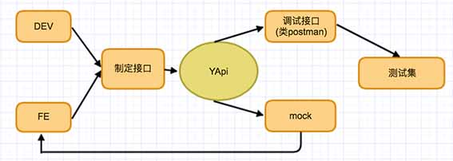

## 百姓QA 可视化接口管理平台

<a target="_blank" href="http://qastar.baixing.cn:3000">qastar.baixing.cn</a>

### 所用开源项目介绍

YApi 是<strong>高效</strong>、<strong>易用</strong>、<strong>功能强大</strong>的 api 管理平台，旨在为开发、产品、测试人员提供更优雅的接口管理服务。可以帮助开发者轻松创建、发布、维护 API，YApi 还为用户提供了优秀的交互体验，开发人员只需利用平台提供的接口数据写入工具以及简单的点击操作就可以实现接口的管理。

### 特性
*  基于 Json5 和 Mockjs 定义接口返回数据的结构和文档，效率提升多倍
*  扁平化权限设计，即保证了大型企业级项目的管理，又保证了易用性
*  类似 postman 的接口调试
*  自动化测试, 支持对 Response 断言
*  MockServer 除支持普通的随机 mock 外，还增加了 Mock 期望功能，根据设置的请求过滤规则，返回期望数据
*  支持 postman, har, swagger 数据导入

### 内网部署
#### 环境要求
* nodejs（7.6+)
* mongodb（2.6+）
* git
#### 安装

    npm install -g yapi-cli --registry https://registry.npm.taobao.org
    yapi server 

#### 升级
升级项目版本是非常容易的，并且不会影响已有的项目数据，只会同步 vendors 目录下的源码文件。

    cd  {项目目录}
    yapi ls //查看版本号列表
    yapi update //更新到最新版本
    yapi update -v {Version} //更新到指定版本

### YApi 插件
* [yapi sso 登录插件](https://github.com/YMFE/yapi-plugin-qsso)
* [yapi cas 登录插件](https://github.com/wsfe/yapi-plugin-cas) By wsfe

### YApi 教程
* [使用 alpine 版 docker 镜像快速部署 yapi](https://www.jianshu.com/p/a97d2efb23c5)
* [Centos-安装环境配置](https://github.com/suxiaoxin/yapi_user_guide/blob/master/centos%20%E5%AE%89%E8%A3%85%E7%8E%AF%E5%A2%83%E9%85%8D%E7%BD%AE.md)
* [MacOS-YAPI初次使用指南](https://github.com/liuyuan1989/yapi_user_guide/blob/master/YAPI%E5%88%9D%E6%AC%A1%E4%BD%BF%E7%94%A8%E6%8C%87%E5%8D%97_MacOS.md) By liuyuan1989

